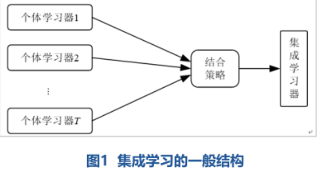
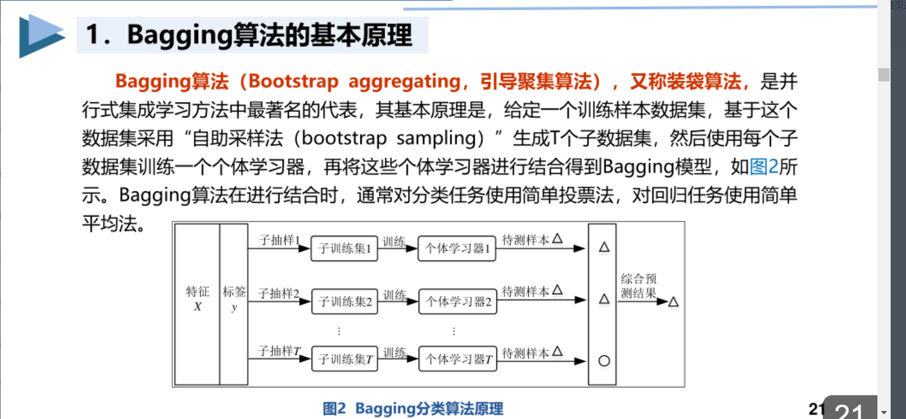
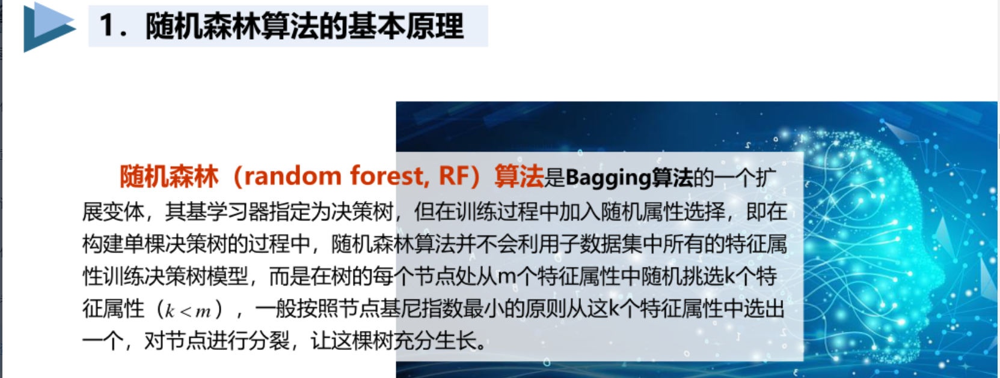
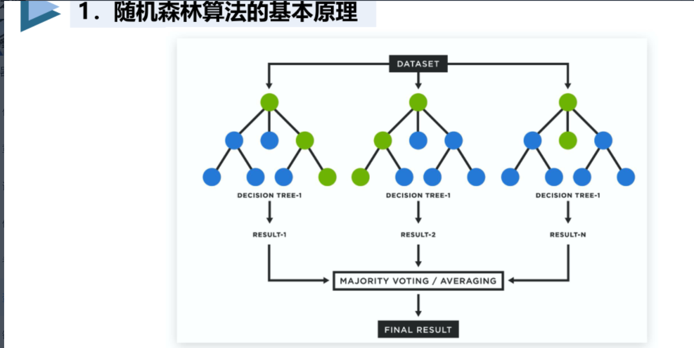
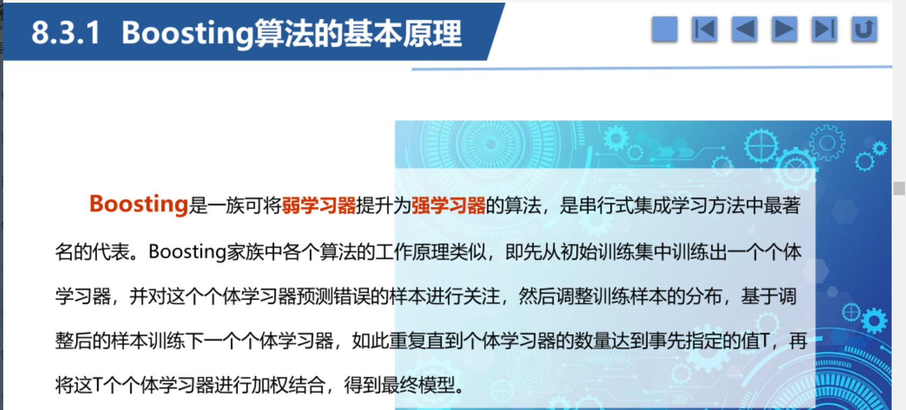

# 集成学习
## 简单定义
集成学习通过多个相同或者不同的模型组合在一起决策。也叫**多模型学习**，或者**基于委员会的学习**。


## 个体学习器集成学习的影响
总结来说，个体学习器应当 **好而不同**。

## 决策方案对集成学习的影响
集成学习的决策方案有：
- 平均法：将多个模型的预测结果取平均。
- 投票法：将多个模型的预测结果投票决定最终的结果。
- 学习法：训练一个集成学习器，使其能够学习到多个模型的预测结果之间的差异。

## 集成学习的分类
### bagging
#### 基本结构：



#### 特点
- 自主采样：每轮迭代中，基学习器只用部分样本训练，从而降低了模型的方差。
- 各个学习器并行训练。

#### 代码实现
```python
#导入分类模块
from sklearn.ensemble import AdaBoostClassifier

#导入回归模块
from sklearn.datasets import AdBoostRegressor

model = AdaBoostClassifier(n_estimators=100, learning_rate=1.0)
```
参数解释：
- base_estimator：jadaboost的基学习器，默认为决策树。
- n_estimators：基学习器的数量。
- learning_rate：学习率，控制基学习器的权重。

### 随机森林
#### 基本结构：

属于bagging的一种，但采用了随机选择的特征子集。


#### 特点
- 自主采样：每轮迭代中，基学习器只用部分样本训练，从而降低了模型的方差。
- 各个学习器并行训练。

#### 代码实现
```python
#导入分类模块
from sklearn.ensemble import RandomForestClassifier

#导入回归模块
from sklearn.datasets import RandomForestRegressor

model = RandomForestClassifier(n_estimators=100, max_depth=None, min_samples_split=2, random_state=0)
```
参数解释：
- n_estimators：基学习器的数量。
- max_depth：决策树的最大深度。
- min_samples_split：节点分裂所需的最小样本数。

### boosting

#### 基本结构：



#### 特点
- 串行训练：每轮迭代中，基学习器只能依次训练，从而保证了模型的顺序。
- 各个学习器串行训练。

#### 代码实现
```python
#导入分类模块
from sklearn.ensemble import GradientBoostingClassifier

#导入回归模块
from sklearn.datasets import GradientBoostingRegressor

model = GradientBoostingClassifier(n_estimators=100, learning_rate=1.0)
```
参数解释：
- base_estimator：基学习器，默认为决策树。
- n_estimators：基学习器的数量。
- learning_rate：学习率，控制基学习器的权重。


## 集成学习的优点
- 降低了方差：集成学习通过多个模型的组合，可以降低模型的方差，使得集成学习的结果更加稳定。
- 提高了预测能力：集成学习通过多个模型的组合，可以提高模型的预测能力，使得集成学习的结果更加准确。
- 改善了泛化能力：集成学习通过多个模型的组合，可以改善模型的泛化能力，使得集成学习的结果更加健壮。

## 集成学习的缺点
- 增加了计算复杂度：集成学习的模型数量越多，计算复杂度也会增加。
- 可能过拟合：集成学习的模型数量越多，可能会出现过拟合现象。
- 可能欠拟合：集成学习的模型数量越少，可能会出现欠拟合现象
