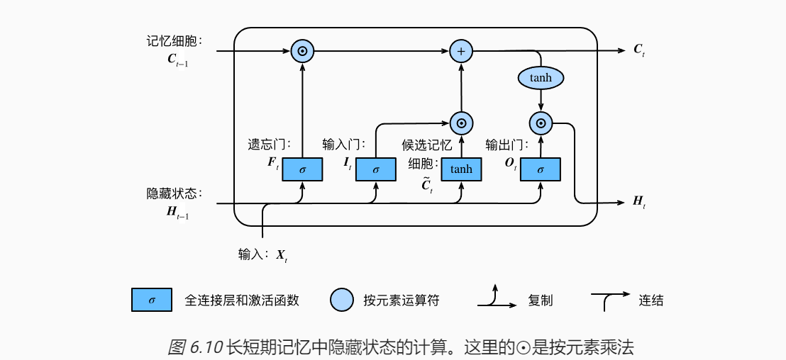
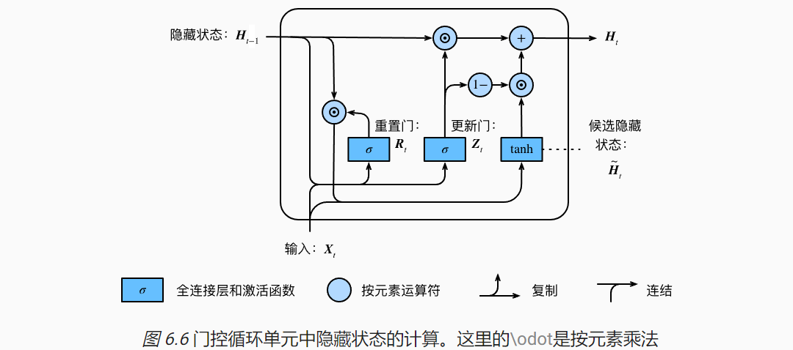
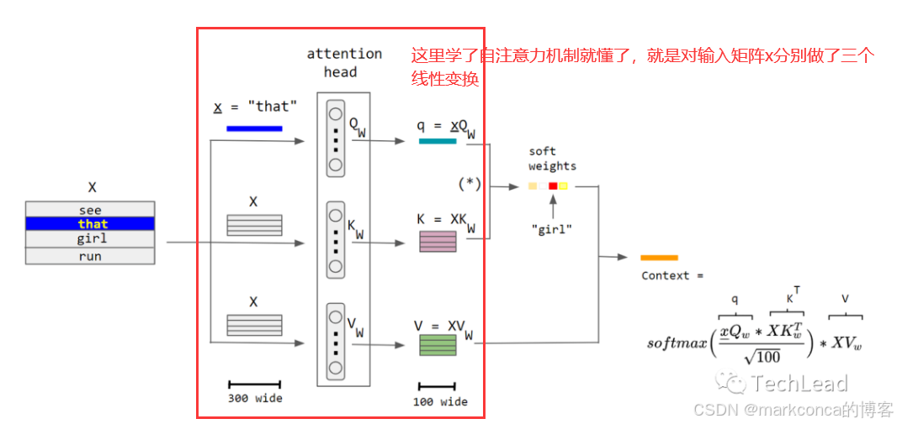

# 深度学习
## 1. 深度学习基本
- 神经网络：由多个神经元组成，每个神经元接收输入信号，经过加权和激活函数后输出信号。
- 反向传播：通过误差反向传播算法，使得神经网络中的权值不断更新，使得神经网络在训练过程中能够更好地拟合数据。

```
我的理解：深度学习主要是通过神经网络实现预测和训练的，正向的带入输入实现对数据的预测，反向根据梯度下降去训练调整参数。基本的预测就是对输入乘以权重加上偏置。

最后我们的目的就是对这个过程的不断优化：输入的方法、参数调整的方法、神经元的排列等的优化。
```

## 2. 深度学习模型
- 卷积神经网络：在图像处理领域中，卷积神经网络（Convolutional Neural Network，CNN）是一种深度学习模型。
- 循环神经网络：循环神经网络（Recurrent Neural Network，RNN）是一种深度学习模型，能够处理序列数据。
- 强化学习：强化学习（Reinforcement Learning，RL）是机器学习领域中的一个重要研究方向，它研究如何让机器学习系统在不断的试错中学会如何做出最好的决策。

## 3. 卷积神经网络（CNN）
- 卷积层：卷积层是卷积神经网络的核心，它对输入数据进行卷积操作，提取图像特征。
卷积层尺寸计算公式：


```
这个就是对于二维数据如何输入处理的解答，我们通过一个卷积核（二维矩阵）对图像进行扫描，对应位置的元素相乘，然后求和，得到一个新的二维矩阵。这也可以叫做是特征提取，将数据通过函数映射到不同的值域。

这里的卷积中的权重就是我们需要通过反馈训练的参数，是需要更新的，训练后可以通过正向计算输出我们想要的结果。
```
- 池化层：池化层是卷积神经网络的另一重要层，它对卷积层输出的特征图进行池化操作，降低特征图的大小，减少计算量。
```
注意：池化层的卷积核的权重是固定的，主要是减小数据量，帮助合并或者删去部分的数据。
```
- 全连接层：全连接层是卷积神经网络的输出层，它将卷积层输出的特征图转换为一维向量，输入到后面的分类器中。

```
全连接层的作用就是将卷积层提取的特征进行分类，分类器的作用就是根据特征向量的不同维度，将其映射到不同的类别。
```
- 卷积神经网络的特点：
    1. 局部感受野：卷积神经网络的卷积核的大小决定了网络的感受野范围，局部感受野能够提取图像的局部特征。
    2. 权重共享：卷积神经网络的卷积核的权重是共享的，这意味着同一个卷积核在不同位置的权重是相同的。
    3. 多层次特征：卷积神经网络的卷积层和池化层能够提取多层次的特征，能够捕捉到图像的全局特征。

## 4. 循环神经网络（RNN）
- 循环神经网络（Recurrent Neural Network，RNN）是一种深度学习模型，能够处理序列数据。
- 循环神经网络的特点：
    1. 使用延时器使循环网络具有记忆能级
    2. 循环网络能够学习长期依赖关系
    3. 循环网络能够处理序列数据
- 循环神经网络的结构：


其中有一个重要的概念是时序，单个的结构会接受上一时刻处理的信息。

这样就会有个问题就是，在反向传播求梯度的时候，根据链式法则，误差关于某个参数的梯度就要乘上之前的函数的参数，由于会考虑上个时段的参数，那么如果是长时间的一个序列，就会在求梯度的时候乘上很多的参数，就容易导致梯度爆炸（乘出来数大过计算机的范围）或者梯度消失（乘法式子中一个为0，就容易导致结果为零，梯度消失）。

为了解决这个问题，就有了门控循环单元（GRU）和长短期记忆网络（LSTM）。

LSTM：




GRU：




## 5. 注意力机制（Attention Mechanism）
- 注意力机制（Attention Mechanism）是一种用于处理序列数据的模型，能够帮助模型学习到长期依赖关系。

```
我的理解，注意力机制是对网络输入优化的一种方法。 

利用相关性打分函数和softmax函数（将打的分数转换到0-1之间的数，及概率值，又叫归一化处理），计算每个输入的和任务的相关性系数，再作为权重乘以对应的输入，来调整每个输入的权重，从而提高模型的学习效率。
```
- 注意力机制的结构：




- 注意力机制分类：
    1. 硬注意力机制：硬注意力机制是指模型只能看到当前时刻的输入，不能看到之前的输入。**考虑最相关的输入权重为1，其他为0.**

    2. 软注意力机制：软注意力机制是指模型可以看到之前的输入，并根据这些输入对当前时刻的输入进行加权。**根据相关性打分，权重越高，越相关。**

    3. 键值对注意力机制：键值对注意力机制是指模型可以看到之前的输入，并根据这些输入对当前时刻的输入进行加权，同时还可以看到当前时刻的输入。**对键求相关性，然后利用求得的权重对值求相关性，作为权重。**

    4. 多头注意力机制：多头注意力机制是指模型可以看到之前的输入，并根据这些输入对当前时刻的输入进行加权，同时还可以看到当前时刻的输入，并且可以有多个注意力头。
    **同时考虑多个注意力头，每个注意力头有不同的权重。**

    5. 自主注意力机制：自主注意力机制是指模型可以看到之前的输入，并根据这些输入对当前时刻的输入进行加权，同时还可以看到当前时刻的输入，并且**可以自主学习注意力权重**。
    